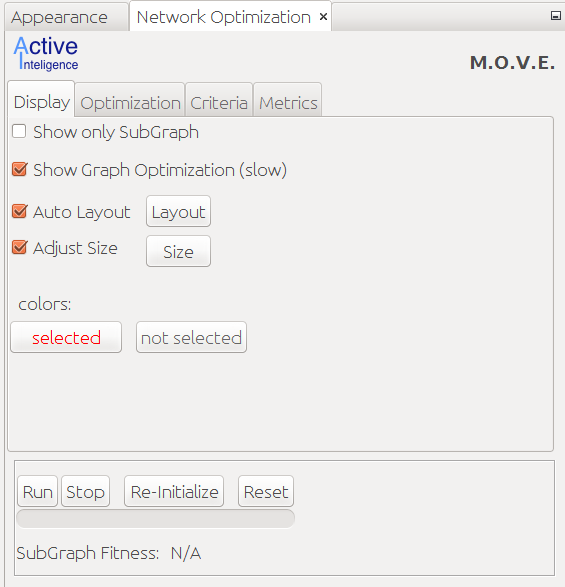

M.O.V.E (Multi-criteria Optimisation and Visualisation
Experimentation tool) allows to quickly visualize your corpus and assist you in selecting informative points/documents to annotate.
It is applicable to most of the corpuses; so give it a try :)

For an introduction see our LREC
[presentation TODO](TODO)
and the corresponding
[paper](http://www.lrec-conf.org/proceedings/lrec2016/pdf/28_Paper.pdf)

<TODO: embeded link to slidehare>

# Installation

Install [Gephi](https://gephi.org) (ver. 0.9+).

Download [MOVE plugin](https://github.com/move-tool/gephi-plugins/raw/master/modules/move/target/move-1.0.0.nbm)

Do a [manual plugin install](https://marketplace.gephi.org/how-to-install-a-plugin/)

# Usage

## Preparation: Data in Network Form

To use the tool; your data needs to be in a network form (Gephi allows importing most of the common formats).

If you data is not yet in a network form for many of the domains a meaningful network representation could be obtained; for examples on how to do that see a [presentation TODO](TODO)

## Starting

Start Gephi.

Load your network.

To see MOVE's UI; in the menu bar select `Window/NetworkOptimizationPanel`.

# Development

MOVE is a plugin for gephi;
see general instructions on how plugins are developed and managed: https://github.com/gephi/gephi-plugins

Plugin's source is in: https://github.com/move-tool/gephi-plugins/tree/master/modules/move

Plugin relies on additional module which would need to be installed in a local maven repository:

* https://bitbucket.org/neil_rubens/genetic-network-optimization/
